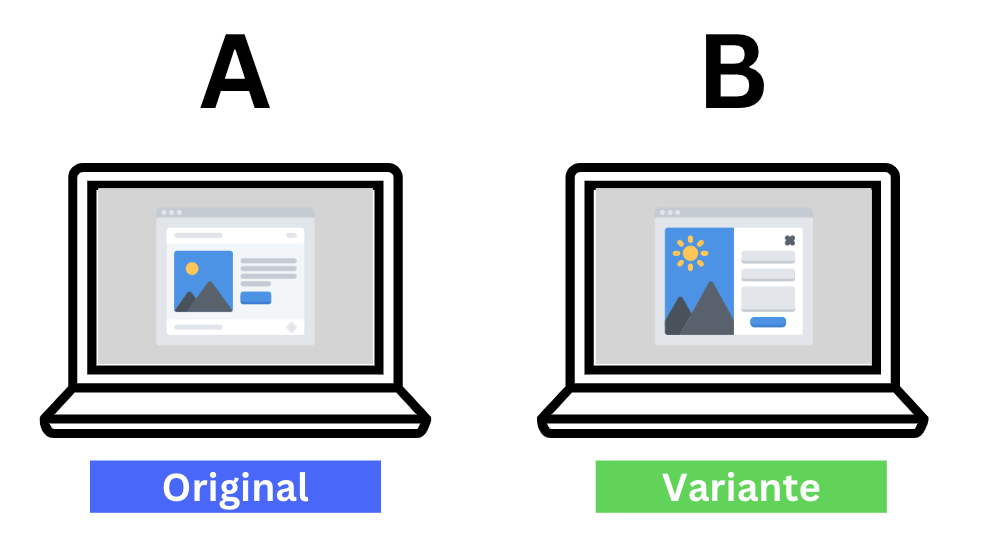

# Marketing A/B Testing and Funnel Analytics

An end-to-end marketing analytics project that turns campaign-level data into a launch recommendation. The project combines exploratory analysis, conversion-funnel diagnostics, non-parametric hypothesis testing, bootstrap confidence intervals, and an interactive financial simulator in a Streamlit dashboard.

**View the Live Interactive Dashboard:** [Click here to open the Streamlit App]([https://abtesting-advertising-experimentation.streamlit.app/])



## Executive Summary

The analysis compares a 30-day **Control Campaign** with a **Test Campaign** across the full customer journey:

`Impressions -> Reach -> Clicks -> Searches -> View Content -> Add to Cart -> Purchase`

The test campaign generated slightly more purchases, but at a materially higher cost. Its creative attracted more users at the top of the funnel, while the downstream experience converted fewer of those users into carts. The resulting recommendation is a **hybrid experiment**: retain the test creative for acquisition, but pair it with the control landing-page experience before scaling.

## Key Findings

| Metric               |   Control |      Test | Business signal                             |
| -------------------- | --------: | --------: | ------------------------------------------- |
| Total spend          | `$68,653` | `$76,892` | Test spend was `12.00%` higher              |
| Total purchases      |  `15,161` |  `15,637` | Test purchases were `3.14%` higher          |
| Cost per acquisition |   `$4.53` |   `$4.92` | Test CPA was approximately `8.59%` higher   |
| Click-through rate   |   `4.86%` |   `8.09%` | Test creative captured more attention       |
| View content to cart |  `66.88%` |  `47.45%` | Test journey lost more users at a key stage |

The dashboard tests whether the observed conversion-rate difference is robust rather than treating a small raw lift as proof of success. Because the test conversion-rate distribution fails the normality check, the workflow uses a **Mann-Whitney U test** and a **10,000-iteration bootstrap simulation** with a 95% confidence interval instead of relying on a t-test alone.

## What the Dashboard Includes

- **General overview:** problem framing, data dictionary, and campaign previews.
- **Campaign economics:** daily and aggregate spend, purchases, and CPA comparisons.
- **Funnel analysis:** stage volumes and step-to-step conversion rates for both campaigns.
- **Statistical testing:** Shapiro-Wilk normality checks, Q-Q plots, Mann-Whitney U testing, and bootstrap uncertainty estimates.
- **Business recommendation:** an evidence-based hybrid strategy and interactive profit simulator.
- **Scenario planning:** adjust budget, impressions, AOV, CTR, view rate, cart rate, and closing rate to estimate purchases, revenue, CPA, and profit.

## Technical Approach

1. Load and clean the raw campaign exports in the accompanying notebook.
2. Standardize column names, parse dates, and handle the missing control-group value.
3. Aggregate campaign performance across the 30-day test period.
4. Compare spend efficiency and purchase volume with Plotly visualizations.
5. Trace leakage through seven funnel stages instead of relying on purchases alone.
6. Calculate purchase conversion rate from impressions and check distributional assumptions.
7. Use non-parametric inference and bootstrap resampling to quantify uncertainty.
8. Translate the analysis into a decision and expose assumptions through the simulator.

## Project Structure

```text
.
├── app.py                         # Streamlit dashboard and analysis logic
├── testing.ipynb                  # Data cleaning and exploratory analysis notebook
├── requirements.txt               # Python dependencies
├── data/
│   ├── control_group.csv          # Raw control campaign export
│   └── test_group.csv             # Raw test campaign export
├── cleaned_data/
│   ├── cleaned_control.csv        # Dashboard-ready control data
│   └── cleaned_test.csv           # Dashboard-ready test data
└── fig/
    └── AB_pic.png                 # Dashboard overview artwork
```

## Run Locally

### Prerequisites

- Python 3.9+
- pip

### Installation

```bash
git clone <your-repository-url>
cd ab-testing
python -m venv .venv
```

Activate the virtual environment:

```bash
# Windows PowerShell
.\.venv\Scripts\Activate.ps1

# macOS/Linux
source .venv/bin/activate
```

Install the dependencies and launch the app:

```bash
pip install -r requirements.txt
streamlit run app.py
```

Streamlit will provide a local URL, typically `http://localhost:8501`.

## Data Notes

The project uses the [A/B Testing Dataset on Kaggle](https://www.kaggle.com/datasets/amirmotefaker/ab-testing-dataset/data). The included data is a compact, campaign-level sample intended for portfolio analysis rather than a production experiment readout. A production decision would also require user-level randomization checks, guardrail metrics, experiment power analysis, attribution controls, and a pre-registered primary metric.

## Skills Demonstrated

**Analytics:** A/B testing, funnel analysis, conversion-rate analysis, acquisition economics, exploratory data analysis, and business recommendation.

**Statistics:** distribution diagnostics, Q-Q plots, Mann-Whitney U testing, bootstrap resampling, and confidence intervals.

**Engineering:** Python data pipelines, cached data loading, interactive Streamlit state, reusable scenario calculations, and Plotly visualization.

**Communication:** translating statistical uncertainty into a practical marketing decision for non-technical stakeholders.

## License

This project is intended for educational and portfolio use.
